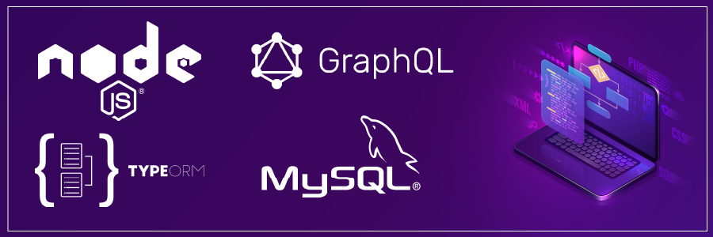

<div align="center">
  <p align="center">
    
  </p>
 <h1>Backend GraphQL Typeorm</h1>
 <h3>Projeto Nodejs utilizando GraphQL, Typeorm e Mysql<h3>
</div>

>Typeorm versão: "^0.3.7" com o novo formato de se conectar ao banco de dados utilizando DataSource


### 1. `Instalando Dependências`
```
$ npm i express express-graphql graphql mysql typeorm cors bcryptjs reflect-metadata dotenv
```

### 2. `Instalando Dependências de Desenvolvimento`
```
$ npm i -D typescript ts-node-dev @types/bcryptjs @types/cors @types/express @types/node dotenv
```

### 3. `Iniciando Typescript`
```
$ npx tsc --init
```

### 4. `Configuração package.json`
```
 "scripts": {
    "dev": "ts-node-dev src/server.ts",
    "build": "tsc -p .",
    "start": "noden dist/server.ts"
  },
```

### 5. `Build do projeto`
```
$ npm run build
```

### 6. `Graphql Playground Queries`

> getAllUsers
```
query {
	getAllUsers
}

```
> getUser
```
query {
	getUser(id: "2") {
    id 
    name
    email
  }
}
```

### 7. `Graphql Playground Mutations`

> createUser
```
mutation {
  createUser(
    name: "Maria",
    email:"maria@maria.com.br",
    password: "12345678",
  ) {
    id
    name
    email
    password
  }
}
```

> updateUser
```
mutation {
  updateUser(
    id: 6
  	input:{
      name: "Dorval",
      email:"dorval@dorval.com.br",
      oldPassword: "12345678",
      newPassword: "dorval123"
    }
  ) {
    success
    message
  }
}
```

> deleteUser
```
mutation {
  deleteUser(id: 6)
}
```